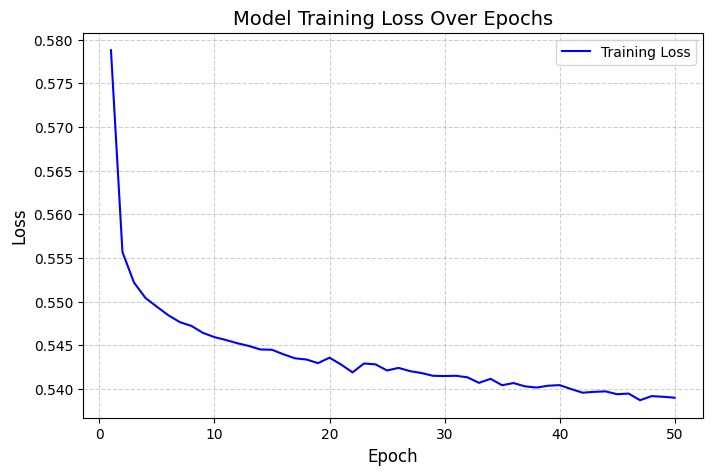
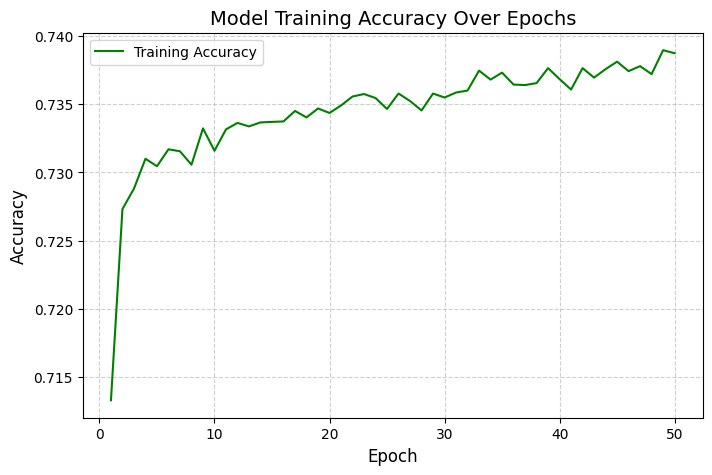
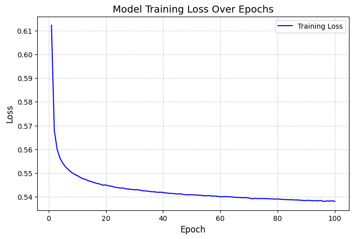
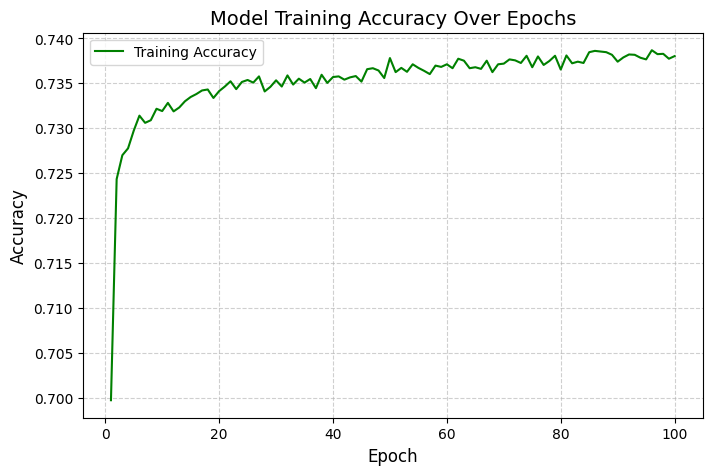
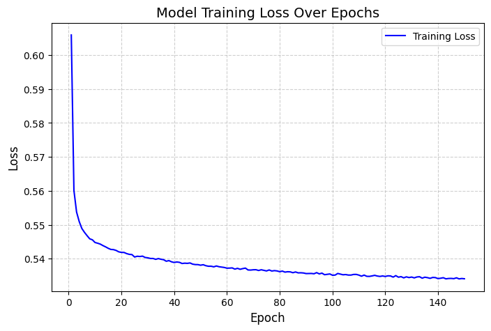
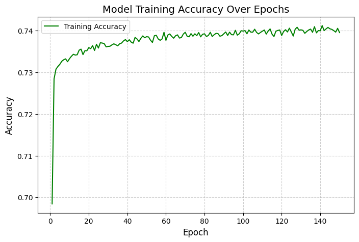
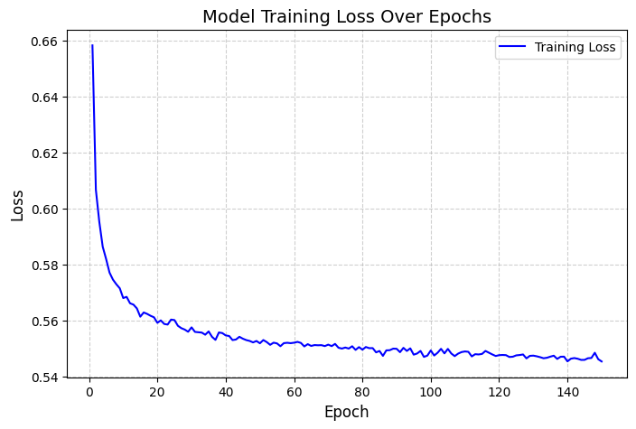
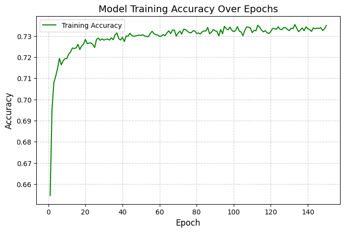

# Deep Learning Challenge

## Overview of the analysis: Explain the purpose of this analysis.

The aim of this analysis is to design a neural network, or deep learning model, to create a binary classification model that can predict if an Alphabet Soup-funded organization will be successful based on the features in the dataset.

## Results: Using bulleted lists and images to support your answers, address the following questions:

### **Data Preprocessing**

**What variable(s) are the target(s) for your model?**  
**Answer :** 
- 'IS_SUCCESSFUL'

**What variable(s) are the features for your model?**  
**Answer :** 
- 'APPLICATION_TYPE', 
- 'AFFILIATION', 
- 'CLASSIFICATION', 
- 'USE_CASE', 
- 'ORGANIZATION', 
- 'STATUS', 
- 'INCOME_AMT', 
- 'SPECIAL_CONSIDERATIONS', 
- 'ASK_AMT'

**What variable(s) should be removed from the input data because they are neither targets nor features?**   
**Answer :** 
- 'EIN', 
- 'NAME'

## Compiling, Training, and Evaluating the Model

### **MODEL 1 : ** Keras Sequential model 1

How many neurons, layers, and activation functions did you select for your neural network model, and why?  

input_feaures = 36

First Dense layer, including the input layer: 
- units = 80 | activation = 'relu' | input_dim = input_features

Second Dense layer: 
- units = 30 | activation = 'relu'

Output Layer:
- units = 1 | activation = 'sigmoid'

Initially the model is kept simple to study the evolution of the training Loss and Accuracy over Epochs.

**Were you able to achieve the target model performance?**
- **Model performance :** Loss: 0.5559306144714355, Accuracy: 0.7284256815910339
- The training Loss shows a gradual decrease in loss and gradual increase in accuracy.
- However we also observe fluctuations (rise and falls). 
- Target performance not reached.

**What steps did you take in your attempts to increase model performance?**

To improve the model performance:
  - We can adjust the learning rate
  - We can increase the number of Epochs

### **Optimization MODEL Version 1 :** Keras Sequential optimized model 1

How many neurons, layers, and activation functions did you select for your neural network model, and why?  

input_feaures = 36

First Dense layer, including the input layer: 
- units = 80 | activation = 'relu' | input_dim = input_features

Second Dense layer: 
- units = 30 | activation = 'relu'

Output Layer:
- units = 1 | activation = 'sigmoid'

**Adjustments in Optimized Model Version 1:**
- Adam(learning_rate=0.0001) to decrease fluctuations
- Increase Number of Epochs for training to 100

**Were you able to achieve the target model performance?**
- **Model performance :** Loss: 0.5556362867355347, Accuracy: 0.7230320572853088
- The training Loss shows a gradual decrease in loss but a fluctuating increase in accuracy.
- The current model does not show tendency to improve training performance above 74% even if we increase training epochs further. 
- Target performance not reached.

**What steps did you take in your attempts to increase model performance?**

To improve the model performance:
  - We can increase the number of units (neurons) in the different layers and increase the number of layers 
  - We can further increase the number of training Epochs 
  - This is expected to capture more details from the input features.

### **Optimization MODEL Version 2 :** Keras Sequential optimized model 2

How many neurons, layers, and activation functions did you select for your neural network model, and why?  

input_feaures = 36

First Dense layer, including the input layer: 
- units = 128 | activation = 'relu' | input_dim = input_features

Second Dense layer: 
- units = 64 | activation = 'relu'

Third Dense layer: 
- units = 32 | activation = 'relu'

Output Layer:
- units = 1 | activation = 'sigmoid'

**Adjustments in Optimized Model version 2:**
- Increase in number of units, 128, 64, 32 and 1 in different layers
- Increase Number of Epochs for training to 150

**Were you able to achieve the target model performance?**
- **Model performance :** Loss: 0.5608576536178589, Accuracy: 0.7255101799964905
- The training Loss shows a gradual decrease in loss but a fluctuating training accuracy around 74%.
- The current model does not show tendency to improve performance even when we increase training epochs further. 
- Target performance of 75 % not reached.

**What steps did you take in your attempts to increase model performance?**

To improve the model performance, we can :
  - Add Dropout Layers to Prevent Overfitting
    - Prevents overfitting by regularizing the network.
    - Improves generalization, leading to higher testing accuracy. 
  - Use Batch Normalization for Faster Convergence
    - Reduces internal covariate shift → Faster and stable training.
    - Allows higher learning rates without divergence.
  - Use Leaky ReLU Instead of ReLU
    - ReLU can cause "dying neurons" where gradients become zero.
    - Leaky ReLU allows small negative slopes instead of setting them to zero.

### **Optimization MODEL Version 3 :** Keras Sequential optimized model 3

How many neurons, layers, and activation functions did you select for your neural network model, and why?  

input_feaures = 36

First Dense layer, including the input layer: 
- units = 128 | activation = 'LeakyReLU' | input_dim = input_features
- batch_normalization and Dropout
Second Dense layer: 
- units = 64 | activation = 'LeakyReLU'
- batch_normalization and Dropout
Third Dense layer: 
- units = 32 | activation = 'LeakyReLU'
Output Layer:
- units = 1 | activation = 'sigmoid'

**Adjustments in Model 3:**
- Add Dropout Layers to Prevent Overfitting
- Use Batch Normalization for Faster Convergence
- Use Leaky ReLU Instead of ReLU
    

**Were you able to achieve the target model performance?**
- **Model performance :** Loss: 0.5568371415138245, Accuracy: 0.7253644466400146
- The training Loss shows a gradual decrease in loss but a fluctuating training accuracy between 73% and 74%.
- The performance with LeakyReLU is not better than 'ReLU'
- Target performance of 75 % not reached.

**What steps did you take in your attempts to increase model performance?**
The deep learning models do not seem to provide 

## Summary: 
- The overall best testing performance (Accuracy: 0.7284256815910339) was obtained by using the model 1 with the following architecture: 
input_feaures = 36

    First Dense layer, including the input layer: 
    - units = 80 | activation = 'relu' | input_dim = input_features

    Second Dense layer: 
    - units = 30 | activation = 'relu'

    Output Layer:
    - units = 1 | activation = 'sigmoid'

- Attempts to optimize considered: 
    - Increasing units in each layers and number of hidden layers, 
    - Increasing number of training epochs, 
    - Changing activation functions from 'ReLU' to 'LeakyReLU", 
     using dropouts to prevent overfitting
    - Use of Batch Normalization for Faster Convergence
- All the options did not improve the performance to above 75%.

### **Recomendation**
- As our data is dataset is mostly numerical/tabular, XGBoost might outperform deep learning models.  

- **Why XGBoost Instead of DNN?**
    - Works exceptionally well for structured/tabular data.
    - Faster training and less hyperparameter tuning needed.
    - Feature importance analysis is easier compared to neural networks.